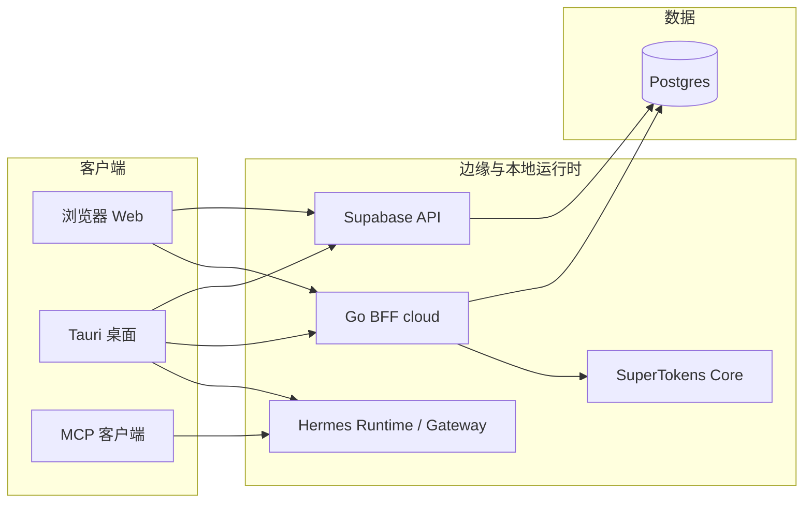

# 全栈架构说明（工程标准）

本文描述本 monorepo 内 **各部署单元职责、数据与身份边界、环境与 CI 约定**，作为全栈开发与拆仓时的参考基线。身份细节仍以 **`docs/architecture-auth-ssot.md`** 为 SSOT；Supabase 集成步骤见 **`SUPABASE_INTEGRATION_GUIDE.md`**。

> 当前总原则：**Hermes Agent-first，OpenClaw compatibility-second**。

---

## 1. 目标与原则

| 原则 | 说明 |
|------|------|
| **Hermes-first** | 本仓库的本地 Agent Runtime、Gateway、MCP、Memory 由 Hermes 自管；OpenClaw 只保留兼容接入能力。 |
| **单一数据源** | 业务库以 Postgres（Supabase 托管）为准；角色与权限合并策略见 SSOT 文档。 |
| **前端轻、后端重** | `anon` 与公开配置仅进前端；`service_role`、模型密钥、运行时密钥仅进服务端或本机安全存储。 |
| **契约先于实现** | 对外 HTTP / MCP 行为以路径、状态码、工具 schema 为准；演进时优先补测试与文档再改实现。 |
| **可复现构建** | `npm run ci`（根）、`tortoise` build、`cloud` / `cloud/web` build 与 CI 对齐。 |

---

## 2. 部署单元与仓库映射

| 单元 | 路径 | 运行时 | 职责 |
|------|------|--------|------|
| **Hermes Runtime 核心** | `src/hermes/` | Node | 本地 runtime、skill runner、tool registry、workspace、安全 memory、MCP 适配。 |
| **兼容桥 / 旧入口** | `src/bridge/`、`extensions/tohelp-openclaw/` | Node | 兼容 `tohelp_*` 入口与 OpenClaw bridge，不承载长期核心逻辑。 |
| **核心插件系统** | `src/plugins/new-core/` | Node | Container / Registry / PluginLifecycle，自研 skill 宿主。 |
| **桌面 / 重客户端** | `tortoise/` | Tauri + Vite + React | ClawX 风格桌面宿主，负责本地运行时控制、配置、诊断、用户界面。 |
| **BFF / API** | `cloud/cmd/server` | Go | SuperTokens 会话、`/auth`、可选 `DATABASE_URL` 下 `/api/me` 与 `profiles` 对齐。 |
| **数据库与 RLS** | `supabase/migrations/` | Supabase / Postgres | 表结构、RLS、`admin_profile_set` 等 RPC。 |
| **OpenClaw 兼容层** | `openclaw-main/`、`.openclaw-dev/` | Node | 可选上游兼容、迁移或桥接场景。不是主运行单元。 |

**说明**：未来若将「营销站 Web」与「Electron/Tauri」拆成两仓，仍建议共享 **同一 API 基址** 与 **同一身份体系**；拆分映射见下文第 9 节。

---

## 3. 网络与信任边界

- **Hermes Runtime**：本地 localhost 进程，负责 `tohelp_*` MCP / gateway 调度与本地 skills 执行。
- **浏览器**：适合 Cookie 类会话（SuperTokens 与 `apiDomain` / `websiteDomain` 对齐）；直连 Supabase 时使用 `anon` + RLS。
- **Tauri**：与浏览器同源策略不同；若启用 SuperTokens，需按 ST 文档使用与 BFF 一致的 `apiDomain`。
- **OpenClaw**：如果接入，只作为兼容路径；其鉴权与会话不应与 Hermes / Supabase 主链路混用。

---

## 4. 环境变量索引（全栈）

| 位置 | 用途 | 禁止 |
|------|------|------|
| 仓库根 `.env.example` → `.env` | 模型 Key、Hermes / MCP / 兼容桥配置 | 不写 Supabase `service_role` |
| `tortoise/.env.example` | `VITE_SUPABASE_*`、可选 `VITE_ST_*` | 不写服务端密钥 |
| `cloud/env.example` → `cloud/.env` | `SUPERTOKENS_*`、`DATABASE_URL`、`CLOUD_*` | 不提交生产库密码 |
| 部署平台 | 各环境独立密钥，最小权限 | 不在前端构建注入特权 |

关键说明：

- Hermes Runtime / MCP 可读取 `HERMES_CONFIG_JSON` 或 `TOHELP_PLUGIN_CONFIG_JSON`。
- 若启用 OpenClaw 兼容层，再提供 `OPENCLAW_GATEWAY_TOKEN`。

---

## 5. API / MCP / Runtime 契约

| 层级 | 约定 |
|------|------|
| **Hermes MCP** | 保持 `tohelp_*` 工具名兼容，内部实现可演进，但 schema 尽量稳定。 |
| **Hermes Gateway** | 本地至少提供 `/health`、`/tools`、`/invoke`、`/memory`。 |
| **Go BFF** | `CLOUD_API_BASE_PATH`（默认 `/auth`）承载 SuperTokens 路由；业务扩展路由与 BFF 版本化保持一致。 |
| **Supabase** | 通过迁移与 RLS 固定数据访问语义；客户端仅依赖公开 URL 与 `anon`。 |
| **演进** | 新增对外行为时：补充 handler 测试 / MCP 测试，更新本文、README 或 SSOT，必要时在 `CHANGELOG.md` 记破坏性变更。 |

---

## 6. 安全基线

- **RLS**：所有终端可写的表在 Supabase 侧启用 RLS；管理类字段仅经 `SECURITY DEFINER` RPC。
- **密钥**：根目录与 CI 不打印密钥；`.gitignore` 已忽略 `.env` 时勿强行 `-f` 提交。
- **Hermes Gateway**：默认仅绑定 `127.0.0.1`，保留 request/header timeout 与安全响应头。
- **OpenClaw 兼容层**：仅在需要迁移或兼容时启用，并单独做 doctor / typecheck。
- **BFF + DB**：`DATABASE_URL` 仅存在于服务端；连接串使用最小权限账号。

---

## 7. 本地全栈联调（推荐顺序）

1. **数据库**：按需应用 `supabase/migrations/`，确认 RLS 与 RPC 与当前客户端假设一致。  
2. **SuperTokens**（若用 BFF 登录）：`cloud/docker-compose.yml` 启动 Core，配置 `cloud/.env` 与 `tortoise` 中 ST 相关变量。  
3. **BFF**：在 `cloud/` 执行 `go run ./cmd/server`，确认日志中的 `APIDomain` 与前端一致。  
4. **Tortoise**：`tortoise` 目录安装依赖后启动 dev，验证登录与受保护页面。  
5. **Hermes**：根目录 `npm run doctor` → `npm run mcp:hermes`，验证 `tohelp_*` 工具与 health probe。  
6. **OpenClaw 兼容层（可选）**：仅在需要兼容验证时运行 `npm run doctor:openclaw` 与 `start-dev.ps1` / `start-dev.sh`。

根目录 **`npm run doctor`** 现在默认用于校验 Hermes，不再把 OpenClaw 当硬前置。

---

## 8. CI/CD 与质量闸

| Job（`.github/workflows/ci.yml`） | 内容 |
|-------------------------------------|------|
| `tohelp` | `npm ci` → `npm run doctor:hermes` → `npm run doctor:secrets:ci` → `npm run ci` |
| `tortoise` | `npm ci` → `npm run build` |
| `cloud` | `go test ./...` → `go build ./cmd/server` |
| `cloud-web` | `npm ci` → `npm run build` |
| `OpenClaw compatibility` | 仅 workflow_dispatch 手动勾选时执行 |

发布前在本地至少执行与对应 job 等价的命令。

---

## 9. 多仓拆分时的对应关系

若将 **营销/控制台 Web** 与 **Electron/Tauri** 分到不同 Git 仓库：

- **共享**：身份提供方（SuperTokens + 同一 Postgres）、API 基址、Hermes MCP / Gateway 契约、环境变量命名约定。  
- **独立发布**：各仓自有版本号；破坏性 API / MCP 变更走版本路径或特性开关。  
- **类型共享**：私有 npm 包、git submodule 或共享 package 同步 DTO / tool schema / 常量。  

---

## 10. 相关文档

| 文档 | 内容 |
|------|------|
| `docs/architecture-auth-ssot.md` | Supabase vs SuperTokens、角色合并、部署模式 A/B |
| `SUPABASE_INTEGRATION_GUIDE.md` | Supabase 与 Tortoise 集成 |
| `docs/optimization/mcp-architecture-guide.md` | MCP / 插件 / 运行时分层 |
| `README.md` | Hermes-first 项目入口与运行说明 |

---

## 11. 维护清单（全栈）

在变更架构、密钥拓扑或 runtime 责任边界时，请勾选：

- [ ] 已更新对应 `.env.example`
- [ ] 已更新 `docs/architecture-auth-ssot.md`、README 或本文相关小节
- [ ] 已跑通本地联调路径（第 7 节）或说明无法联调原因
- [ ] CI 仍通过（`tohelp` / `tortoise` / `cloud` / `cloud-web`）
- [ ] 若变更影响兼容层，已执行 OpenClaw compatibility 验证
